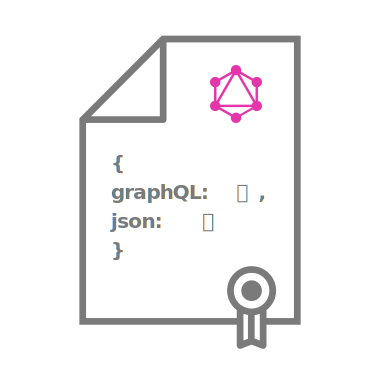

<h1 align="center">
	<br>
	
	<br>
	<br>
	<br>
</h1>

> Validate JSON with a GraphQL schema


## Install

```
$ npm install --save-dev jql-validation
```


## Usage

Define a schema:

```graphql
enum Episode {
    NEWHOPE
    EMPIRE
    JEDI
}

type Character {
  id: ID!
  name: String!
  appearsIn: [Episode]!
  isLegacy: Boolean!
}
```

Validate you JSON:

TO DO!! 🤖

## Created by

- [Nicola Zanon](https://nicola-zanon.com)
- [Korneliusz Rabczak](http://thecookiezen.com)


## License

MIT ©